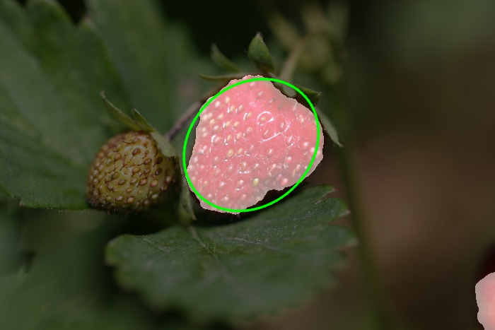

# cv-strawberry

Image Processing project to detect strawberries using [OpenCV](https://github.com/opencv/opencv) Computer Vision library.

## Files

To open the main code, simply open [`strawberry.ipynb`](strawberry.ipynb) on any desktop browser, or you can download and run the cells in a Python 2 environment. The code is presented in a [Jupyter Notebook](https://github.com/jupyter/notebook) / iPython notebook for readability purposes.

## Overview

The code detects the presence of ripe strawberry in an image, then draws an ellipse around the biggest detected strawberry in the image.

## Dependencies

This project requires **Python 2** and the following Python libraries installed:

* [NumPy](http://www.numpy.org/)
* [OpenCV 2.4.11](https://anaconda.org/menpo/opencv)
* [matplotlib](http://matplotlib.org/)

